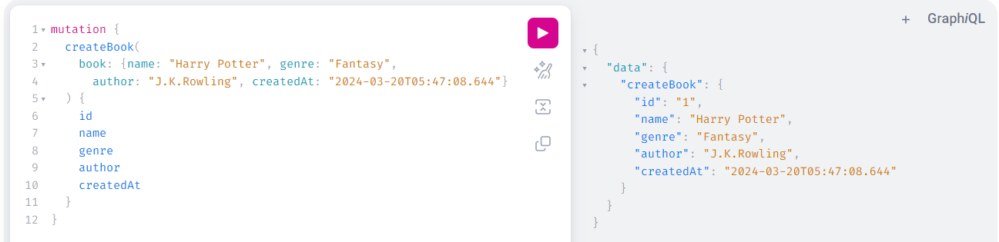
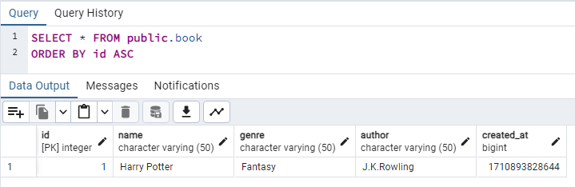

# GraphQL Custom Scalar with Spring Boot

This project demonstrates the implementation of a **GraphQL custom DateTime Scalar** using Spring Boot, which facilitates the conversion between 'Milliseconds' (Long) and 'LocalDateTime' (String).

### What are GraphQL Scalars?

Scalars represent primitive data types which are atomic, meaning they cannot be decomposed further.

When defining a GraphQL schema, we can use built-in scalar types provided by GraphQL, such as Int, Float, String, Boolean, and ID, or define custom scalar types tailored to our application's specific needs.

Custom scalar types allow us to define and handle specialized data formats such as dates, timestamps, or any other custom data types not covered by the built-in scalars.

### Prerequisites
Before running the application, make sure the following list is installed/configured on your machine:

* Java version 17 or above
* Maven
* PostgreSQL
* pgAdmin (Optional)

### Running the Application

1. Clone the project using the command `git clone https://github.com/ruviniramawickrama/demo-graphql-custom-scalar-with-spring-boot.git`
2. Go to the cloned project's root directory and open a command prompt
3. Build the project using the command `mvn clean install`
4. Run the project using the command `mvn spring-boot:run`
5. Open the GraphQL playground url http://localhost:8080/graphiql
6. Use the sample GraphQL Queries and Mutations given in the file `queries-and-mutations` to test the endpoints (`\src\main\resources\graphql\queries-and-mutations`)

For example, when we execute the `createBook` Mutation, the value for the `createdAt` field gets saved in the database as Milliseconds, but when sending the response for the created Book details, it gets converted again to LocalDateTime.

### Application Details

`pom.xml`
- Contains the dependencies related to GraphQL, Postgres (database connection), Spring Data JPA and Lombok.

`application.yml`
- Contains the properties related to GraphQL, JPA and Postgres.

`schema.sql`
- Contains DDL SQL script to create the `Book` table in the database.
- When the application starts, Spring Boot automatically runs the content of this file based on the `sql` and `jpa` properties mentioned in the `application.yml` file.

`DateTimeScalarConfig.java`
- Defines a custom Scalar type named `DateTime` for handling date and time values in a GraphQL schema.

`schema.graphqls`
- GraphQL schema definition which contains Queries to retrieve data from the database and Mutations to manipulate data in the database. 
- For this example, we have defined a custom Scalar named `DateTime` in the GraphQL schema which utilizes the implementation in `DateTimeScalarConfig.java`. 
- The Mutation named `createBook` utilizes the custom defined `DateTime` Scalar to convert from 'LocalDateTime' (String) to 'Milliseconds' (Long)  when creating a Book and utilizes the same custom Scalar to convert from 'Milliseconds' (Long) to 'LocalDateTime' (String) when returning the response for the created Book .
- The Query named `getBooks` uses the custom defined `DateTime` Scalar to convert from 'Milliseconds' (Long) to 'LocalDateTime' (String) when sending the Book details response.

`BookController.java`
- Controller class which contains the mappings for the Query and Mutation defined in `schema.graphqls`.

`BookService.java`
- Implemented by `BookServiceImpl.java` which is responsible for communicating with the repository class to create and retrieve Book details from the database.

`BookRepository.java`
- Implements Spring Data JpaRepository which provides ready-made methods to communicate with the database. It uses `Book.java` as the entity which maps with the respective database table.
